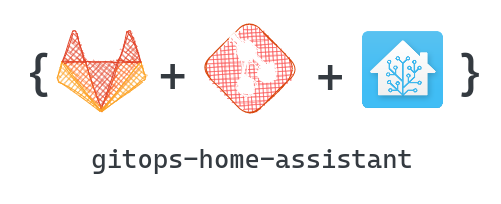

<!--
*** Thanks for checking out the Best-README-Template. If you have a suggestion
*** that would make this better, please fork the repo and create a pull request
*** or simply open an issue with the tag "enhancement".
*** Don't forget to give the project a star!
*** Thanks again! Now go create something AMAZING! :D
-->

<!-- PROJECT SHIELDS -->
<!--
*** I'm using markdown "reference style" links for readability.
*** Reference links are enclosed in brackets [ ] instead of parentheses ( ).
*** See the bottom of this document for the declaration of the reference variables
*** for contributors-url, forks-url, etc. This is an optional, concise syntax you may use.
*** https://www.markdownguide.org/basic-syntax/#reference-style-links
-->

<!-- PROJECT LOGO -->
 

  

  <h3 align="center">gitops-home-assistant</h3>

  

    GitOps workflows for home-assistant config files!
     
     
  

<!-- TABLE OF CONTENTS -->
<!--

  
Table of Contents

  <ol>
    <li>
      <a href="#about-the-project">About The Project</a>
    </li>
  </ol>

-->

<!-- ABOUT THE PROJECT -->

## About The Project

![Product Overview][product-overview]

Enable GitOps workflows for home-assistant configuration files.

Here's why:

- GitOps is my method of choice when applying configurations to a system in this case our system is home-assistant.
- Changes in the repo are auto applyed, it is transparent who has changed what and when.
- Just make your life easyer and edit your home-assistant config in your editor of choice and use known development workflows and tools :smile:

This repo was heavily inspired by [budimanjojo][budimanjojo-blog], thanks a lot for your work and the hints.

(<a href="#top">back to top</a>)

<!-- MARKDOWN LINKS & IMAGES -->
<!-- https://www.markdownguide.org/basic-syntax/#reference-style-links -->

[product-overview]: docu/gitops-home-assistant-white.png
[budimanjojo-blog]: https://budimanjojo.com/2021/11/04/gitops-home-assistant-configurations/
